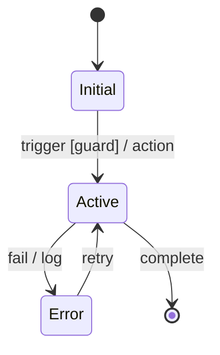
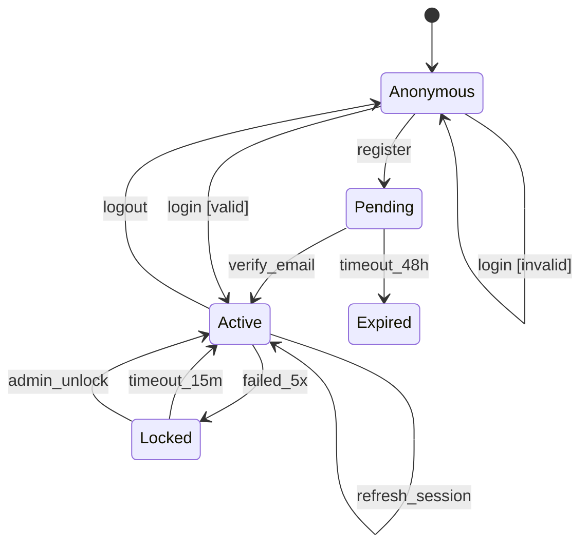

Decompose requirements into phased task files using Gherkin scenarios and state machines.

**Output location:** `docs/tasks/`

**Approach:** Gherkin-first + State Machine validation

---

## Step 1: Pattern Matching (Quick Check)

Before writing scenarios, scan for vague terms:

| Pattern | Problem | Fix |
|---------|---------|-----|
| fast, quick, slow | Unmeasurable | Define in ms |
| secure, safe | Undefined | Specify standard |
| easy, simple | Subjective | Define criteria |
| some, many, few | Vague quantity | Exact number |
| etc, and more | Incomplete | List all |
| handle, process, manage | Vague verb | Specific action |
| automatically | Magic | Define logic |

**If vague terms found:** Ask user to clarify before proceeding.

---

## Step 2: State Machine (REQUIRED)

For each feature, draw the state machine FIRST.

### Template

```
Feature: [Name]

States:
  - Initial: [starting state]
  - Normal: [state1], [state2], ...
  - Error: [error1], [error2], ...
  - Final: [end state(s)]

Transitions:
  [from] --[trigger]--> [to] : [action/side-effect]
```

### Mermaid Diagram



### Completeness Check

```
[ ] Every state reachable from initial?
[ ] Every non-final state has exit?
[ ] Error state exists for each operation?
[ ] Timeout state if time-sensitive?
[ ] All transitions have triggers?
```

### Common Missing States

| Feature Type | Often Forgotten |
|--------------|-----------------|
| Auth | `locked`, `suspended`, `pending_verification` |
| Payment | `pending`, `failed`, `refunded`, `disputed` |
| Order | `cancelled`, `partial`, `on_hold` |
| Content | `draft`, `scheduled`, `archived` |
| User | `invited`, `inactive`, `banned` |

---

## Step 3: Gherkin Scenarios (REQUIRED)

Write scenarios for EVERY state and transition in the state machine.

### Format

```gherkin
Feature: [Feature Name]
  As a [actor]
  I want [goal]
  So that [benefit]

  # Define terms used in this feature
  Definitions:
    - Term1: explanation
    - Term2: explanation

  @must
  Scenario: [Happy path - most common success]
    Given [precondition]
    When [action]
    Then [result]

  @must
  Scenario: [Error case - most common failure]
    Given [precondition]
    When [action]
    Then [error result]

  @should
  Scenario: [Important but not critical]
    ...

  @could
  Scenario: [Nice to have]
    ...
```

### Priority Tags

| Tag | Meaning | Delivery |
|-----|---------|----------|
| `@must` | Cannot launch without | This release |
| `@should` | Important, expected | This release if possible |
| `@could` | Nice to have | If time permits |
| `@wont` | Explicitly excluded | Document why |

### Coverage Checklist

For each feature, verify scenarios exist for:

```
[ ] Happy path (success)
[ ] Empty/missing input (each required field)
[ ] Invalid format (each validated field)
[ ] Unauthorized access
[ ] Not found (missing resource)
[ ] Conflict (duplicate, race condition)
[ ] Each error state from state machine
[ ] Each state transition from state machine
```

### State Machine → Gherkin Mapping

Every state machine transition becomes at least one scenario:

| State Machine | Gherkin Scenario |
|---------------|------------------|
| `Initial --> Active: register` | "Successful registration" |
| `Initial --> Error: invalid_input` | "Registration fails with invalid email" |
| `Active --> Locked: 5_failures` | "Account locks after 5 failed logins" |
| `Locked --> Active: timeout` | "Account unlocks after 15 minutes" |

---

## Step 4: Decomposition

Only after Steps 1-3 complete.

### Task Generation Rules

1. **One scenario = One or more tasks** (depending on complexity)
2. **@must scenarios first** (early phases)
3. **@should scenarios next** (middle phases)
4. **@could scenarios last** (final phases)
5. **Vertical slices** (end-to-end, not horizontal layers)

### Phase Structure

```
Phase 1: Foundation
  - Entities for all states
  - Base services

Phase 2-N: Features (by priority)
  - @must scenarios implemented
  - @should scenarios implemented
  - Tests for each scenario

Final Phase: Polish
  - @could scenarios
  - Edge cases
  - Performance
```

---

## Output Structure

```
docs/tasks/
├── 00-specifications.md       # State machines + Gherkin scenarios
├── 01-overview.md             # Summary, phases, priorities
│
├── phase-01-foundation.md     # Entities, base setup
├── phase-02-[feature].md      # @must scenarios
├── phase-03-[feature].md      # @should scenarios
└── ...
```

### 00-specifications.md Format

```markdown
# [Feature] Specifications

## State Machines

### User Account States

[Mermaid diagram]

| State | Description | Entry | Exit |
|-------|-------------|-------|------|
| ... | ... | ... | ... |

## Gherkin Scenarios

### Feature: User Registration

[Full Gherkin with all scenarios]

### Feature: User Login

[Full Gherkin with all scenarios]

## Coverage Matrix

| State/Transition | Scenario | Priority |
|------------------|----------|----------|
| Initial → Active | Successful registration | @must |
| Initial → Error | Registration validation | @must |
| ... | ... | ... |
```

### phase-XX-*.md Format

```markdown
# Phase 2: User Registration

## Scenarios Covered

| Scenario | Priority | Status |
|----------|----------|--------|
| Successful registration | @must | ⬜ |
| Registration validation errors | @must | ⬜ |

## Tasks

### Task 2.1: Create Registration Service

**Scenarios:** Successful registration, Registration validation errors

**Files:**
- `src/modules/auth/services/register-service/`

**Acceptance:** Scenarios pass as tests

---

### Task 2.2: Create Registration Action

...

## Phase Checklist

- [ ] All @must scenarios pass
- [ ] All @should scenarios pass
- [ ] State transitions verified
```

---

## Example

**Input:**
```
/decompose-requirements User authentication with email/password login
```

**Step 2 Output (State Machine):**


**Step 3 Output (Gherkin):**
```gherkin
Feature: User Authentication
  As a visitor
  I want to register and login
  So that I can access my account

  Definitions:
    - User: registered account with email/password
    - Session: JWT token, 24h validity
    - Locked: blocked after 5 failed logins, 15min duration

  @must
  Scenario: Successful registration
    Given a visitor on registration page
    When they submit valid email and password
    Then account should be created in "pending" state
    And verification email should be sent

  @must
  Scenario: Successful login
    Given a verified user "user@example.com"
    When they submit correct password
    Then session should be created
    And they should see dashboard

  @must
  Scenario: Login with wrong password
    Given a verified user "user@example.com"
    When they submit wrong password
    Then they should see "Invalid credentials"
    And failed attempt counter should increment

  @should
  Scenario: Account locks after 5 failures
    Given a user with 4 failed attempts
    When they fail login again
    Then account should be "locked"
    And they should see "Account locked for 15 minutes"

  @should
  Scenario: Locked account unlocks after timeout
    Given a locked account
    And 15 minutes have passed
    When user attempts login with correct password
    Then login should succeed
```

**Output Files:**
```
docs/tasks/
├── 00-specifications.md    # State machine + all Gherkin
├── 01-overview.md          # 4 phases, priority breakdown
├── phase-01-foundation.md  # User entity, Session entity
├── phase-02-registration.md # Register + verify scenarios
├── phase-03-login.md       # Login + logout scenarios
└── phase-04-security.md    # Lock/unlock scenarios
```

---

## Quick Reference

```
1. Pattern match → catch vague terms
2. State machine → draw ALL states and transitions
3. Gherkin → write scenario for EACH transition
4. Decompose → tasks grouped by priority (@must first)
```

**Minimum to proceed:**
- No vague terms (or clarified)
- State machine complete (all states, all transitions)
- Every transition has at least one scenario
- Every scenario has priority tag
