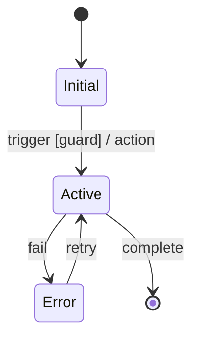

# Skill: Decompose Requirements

Decompose requirements into phased task files using Gherkin + State Machine approach.

## When to Use

- User provides a feature request or requirements document
- User asks to break down a complex feature into tasks
- Keywords: "decompose", "break down", "task files", "requirements"

---

## Approach: Gherkin-First + State Machine

| Tool              | Purpose                                           |
| ----------------- | ------------------------------------------------- |
| **State Machine** | See ALL possible states (catches what you forgot) |
| **Gherkin**       | Describe behavior for each state/transition       |

They complement each other:

- Gherkin might miss states you didn't write scenarios for
- State machine forces you to see ALL states visually

---

## Step 1: Pattern Matching (Quick)

Scan for vague terms before proceeding:

| Vague           | Fix              |
| --------------- | ---------------- |
| fast, slow      | Define in ms     |
| secure          | Specify standard |
| easy, simple    | Define criteria  |
| some, many      | Exact number     |
| etc             | List all         |
| handle, process | Specific action  |
| automatically   | Define logic     |

**If found:** Ask user to clarify.

---

## Step 2: State Machine (Required)

Draw state machine FIRST, before writing scenarios.

### Template



### Checklist

```
[ ] Every state reachable?
[ ] Every non-final state has exit?
[ ] Error states exist?
[ ] Timeout states if needed?
```

### Common Missing States

| Feature | Often Forgotten             |
| ------- | --------------------------- |
| Auth    | locked, suspended, pending  |
| Payment | pending, failed, refunded   |
| Order   | cancelled, partial, on_hold |
| Content | draft, scheduled, archived  |

---

## Step 3: Gherkin Scenarios (Required)

Write scenario for EVERY state machine transition.

### Format

```gherkin
Feature: [Name]
  As a [actor]
  I want [goal]
  So that [benefit]

  Definitions:
    - Term: explanation

  @must
  Scenario: Happy path
    Given [precondition]
    When [action]
    Then [result]

  @must
  Scenario: Error case
    Given [precondition]
    When [action]
    Then [error]

  @should
  Scenario: Important secondary
    ...

  @could
  Scenario: Nice to have
    ...
```

### Priority Tags

| Tag       | Meaning               |
| --------- | --------------------- |
| `@must`   | Cannot launch without |
| `@should` | Important, expected   |
| `@could`  | Nice to have          |
| `@wont`   | Explicitly excluded   |

### Coverage Checklist

```
[ ] Happy path
[ ] Empty/missing input
[ ] Invalid format
[ ] Unauthorized
[ ] Not found
[ ] Conflict
[ ] Each error state
[ ] Each state transition
```

### State Machine → Gherkin

| Transition          | Scenario                  |
| ------------------- | ------------------------- |
| `A --> B: trigger`  | "Successful [trigger]"    |
| `A --> Error: fail` | "[trigger] fails when..." |

---

## Step 4: E2E Scenario Mapping (REQUIRED)

Map Gherkin scenarios to E2E test specifications. Output: `docs/tasks/<feature>/e2e-scenarios.md`

### Mapping Rules

| Gherkin Tag | E2E Requirement |
|-------------|-----------------|
| `@must` | Full locale coverage (en + th) |
| `@should` | At least one locale |
| `@could` | Listed as optional (skipped) |
| `@wont` | Excluded |

### Output Format

```markdown
# E2E Test Scenarios

Source: `docs/tasks/<feature>/00-specifications.md`

## Feature: [Feature Name]

### Scenario: [Gherkin Scenario Title]
- **Priority:** @must
- **Route:** /[locale]/[path]
- **Preconditions:** [Setup needed]
- **Steps:**
  1. Navigate to [route]
  2. Click `[data-testid="module-component-element"]`
  3. Fill `[data-testid="module-form-field"]` with "value"
- **Assertions:**
  - [ ] [Expected outcome using data-testid selectors]
- **Locale coverage:** en, th
```

### Rules

- Every step MUST reference `data-testid` selectors or accessible roles
- Include the expected `data-testid` values following the convention: `<module>-<component>-<element>`
- Group scenarios by feature, matching the Gherkin structure

---

## Step 5: Decomposition

### Rules

1. One scenario = one or more tasks
2. `@must` first → early phases
3. `@should` next → middle phases
4. `@could` last → final phases
5. Vertical slices (end-to-end)

### Output

```
docs/tasks/<feature>/
├── 00-specifications.md    # State machines + Gherkin
├── 01-overview.md          # Summary, phases
├── phase-01-foundation.md  # Entities, setup
├── phase-02-[sub-feature].md # @must scenarios
└── ...
```

---

## Quick Reference

```
1. Pattern match → catch vague terms
2. State machine → ALL states and transitions
3. Gherkin → scenario for EACH transition
4. E2E mapping → map scenarios to E2E test specs
5. Decompose → @must first, vertical slices
```

## Example

**Input:** "User authentication"

**State Machine:**

```
Anonymous → Pending (register)
Pending → Active (verify)
Anonymous → Active (login)
Active → Locked (5 failures)
Locked → Active (timeout)
Active → Anonymous (logout)
```

**Gherkin:**

```gherkin
@must Scenario: Successful registration
@must Scenario: Successful login
@must Scenario: Login fails with wrong password
@should Scenario: Account locks after 5 failures
@should Scenario: Account unlocks after timeout
```

**Output:**

```
phase-01-foundation.md  # User, Session entities
phase-02-registration.md # Register + verify
phase-03-login.md       # Login + logout
phase-04-security.md    # Lock/unlock
```
