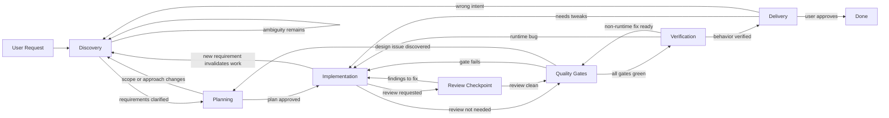
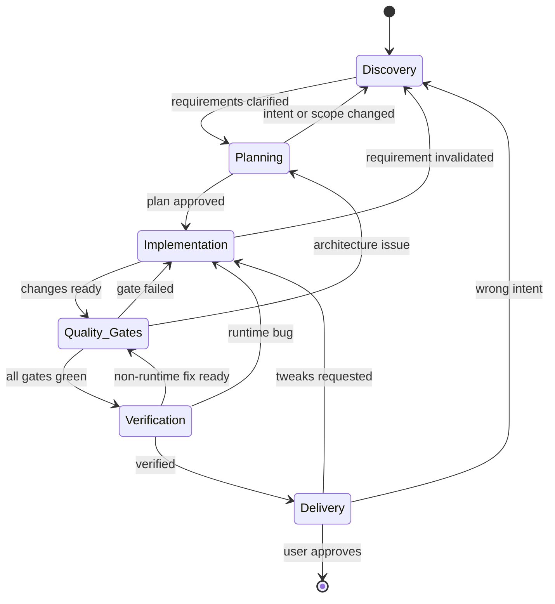
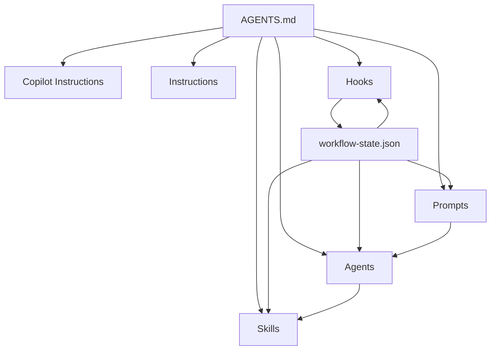

# Vibe Copilot Workflow

> Make AI work like real engineers.

The workflow standard for teams that want AI agents to work like disciplined software engineers.

This repository packages a reusable operating model that turns AI-assisted coding from an ad hoc chat experience into a governed software engineering workflow.

It is designed for teams that want AI agents to be:

- strict about process
- predictable in output
- explicit about state
- capable of recovery
- efficient with tokens
- portable across new projects and tech stacks

---

## Start here

This README serves two main audiences in one file:

- adopting the template into another repository
- contributing to this repository itself

Use these entrypoints to jump to the right part of the document:

- adopting the template: [Adopt This Template in Another Repository](#adopt-this-template-in-another-repository)
- contributing to the repo: [Contributor validation](#contributor-validation)
- need the shortest version first: [Quick reference](#quick-reference)

---

## Why this exists

Many AI coding sessions fail for the same reasons:

- implementation starts before requirements are clear
- planning is skipped
- tests and verification are treated as optional
- the agent forgets what phase it is in
- failure recovery is improvised instead of systematic
- outputs vary from run to run

This standard solves that by introducing a canonical workflow, a shared state file, specialized agents, reusable prompts and skills, and deterministic hooks that enforce the workflow instead of merely describing it.

---

## Design goals

The framework is built around eight goals:

1. **Workflow adherence**
2. **Correctness**
3. **Consistency**
4. **Error recovery**
5. **State awareness**
6. **Minimal rework**
7. **User satisfaction**
8. **Token efficiency**

## Convention model

This workflow uses a contract-driven convention model.

- the workflow contract is the source of truth
- sample repositories and migrations are validation targets, not canonical references
- recurring structural decisions should be removed from task-level reasoning whenever the workflow can decide them once

The workflow classifies convention decisions into three tiers:

- **Hard conventions**: fixed grammar that should not drift without an explicit user or profile-level decision
- **Strong defaults**: preferred answers that should be reused unless the plan records a reason to deviate
- **Local freedom**: implementation detail that may vary inside a stable contract

See [docs/convention-tier-model.md](./docs/convention-tier-model.md).

---

## Why teams adopt it

### 1. Better process discipline

The workflow prevents:

- coding before discovery
- coding before planning
- delivery before quality gates
- silent state drift

### 2. More reliable output

Because the workflow is phase-based and explicit, it becomes much harder for the agent to:

- improvise architecture
- mutate scope accidentally
- hide failed gates
- forget blockers

### 3. Less rework

Discovery and planning happen early, which reduces:

- wrong first implementations
- repeated rewrites
- duplicated clarification
- late architectural backtracking

### 4. Easier team adoption

This standard gives teams a shared vocabulary:

- what phase are we in?
- what is blocked?
- what needs approval?
- what failed?
- where do we roll back to?

### 5. Better token efficiency

Always-on files stay small and stable, while deeper procedures live in skills and are only loaded when relevant.

---

## The six-phase workflow

The workflow is **a controlled loop**, not a one-way pipeline.

Every non-trivial task moves through these phases:

1. **Discovery**
2. **Planning**
3. **Implementation**
4. **Quality Gates**
5. **Verification**
6. **Delivery**

If something fails, the system rolls back to the earliest valid phase and continues from there.

---

## Operational flow



The flowchart shows how work can move through prompts, roles, and checkpoints. It includes the optional review checkpoint that can sit between Implementation and Quality Gates.

---

## Formal phase state machine



The state machine models only the six formal phases stored in `.github/workflow-state.json`. It does not try to represent every operational checkpoint or prompt handoff.

---

## Phases vs. checkpoints

- `Discovery`, `Planning`, `Implementation`, `Quality Gates`, `Verification`, and `Delivery` are the only formal phases persisted in workflow state.
- `Review` is an operational checkpoint invoked through `review-work`; it can send work back to Implementation or forward to Quality Gates.
- A task can move from Implementation straight to Quality Gates when no separate review pass is needed.
- The `Verification --> Quality_Gates` transition means a non-runtime issue was fixed and the automated gate sequence must run again before delivery.

---

## Operating model

The standard is built from layered artifacts with separate responsibilities.

| Artifact | Role | Why it exists |
| --- | --- | --- |
| `AGENTS.md` | Canonical workflow contract | Defines the phase model, rules, rollback logic, state contract, and done criteria |
| `.github/copilot-instructions.md` | Always-on Copilot summary | Keeps daily behavior aligned without duplicating the full contract |
| `.github/instructions/` | Targeted overlays | Adds narrow rules for workflow, quality gates, and AI customization files |
| `.github/prompts/` | User-facing entrypoints | Gives repeatable commands for discovery, planning, implementation, review, recovery, gates, and delivery |
| `.github/skills/` | Deep procedures | Loads detailed checklists and phase-specific guidance on demand |
| `.github/agents/` | Specialist roles | Separates orchestration, discovery, planning, implementation, review, and verification |
| `.github/hooks/` | Deterministic enforcement | Prevents phase skipping, validates state edits, blocks early delivery, and logs decisions |
| `.github/workflow-profile.json` | Repository adoption profile | Captures repo-specific commands, roots, generated artifacts, convention tiers, and adoption defaults |
| `.github/workflow-state.json` | Control plane state | Tracks phase, requirements, plan status, gates, retries, blockers, and delivery readiness |

Skill authoring in this repository follows the open [Agent Skills standard](./docs/agent-skills-standard.md) so local skills remain portable across compatible tools.

---

## Artifact map



---

## Roles and handoffs

This standard uses a role model that is clear enough to scale across teams.

| Role | Primary phase | Responsibility |
| --- | --- | --- |
| **Orchestrator** | Cross-phase | Owns sequencing, state, rollback decisions, and handoff |
| **Requirements Analyst** | Discovery | Clarifies intent, scope, constraints, and acceptance criteria |
| **Planner** | Planning | Produces an explicit implementation plan and validation strategy |
| **Implementer** | Implementation | Makes approved changes, updates tests, and stays inside scope |
| **Reviewer** | Implementation / Verification handoff | Reviews correctness, convention compliance, and avoidable risk before final gates and delivery |
| **Verifier** | Quality Gates / Verification / Delivery | Runs gates, verifies behavior, and prepares final delivery evidence |

The sub-agents are intentionally stateless. State lives in the workflow model, not in agent memory.

The Reviewer does not add a seventh workflow phase. It is a deliberate handoff between implementation and the Verifier-owned gate and delivery path.

---

## Recommended entrypoints

Use the user-facing prompts in this order when they apply:

- `discover-requirements`: turn a vague request into scope, constraints, and acceptance criteria.
- `plan-implementation`: turn clarified requirements into an explicit plan with files in scope and validation steps.
- `implement-approved-plan`: make the approved changes without expanding scope.
- `review-work`: run the optional review checkpoint before final gates when the implementation stabilizes.
- `run-quality-gates`: run the repository's real automation after review findings are resolved or when no separate review pass is needed.
- `verify-and-deliver`: confirm acceptance criteria, capture final validation status, and prepare the handoff.

---

## Quick reference

### Phase order

```text
Discovery -> Planning -> Implementation -> Quality Gates -> Verification -> Delivery
```

### Core question at each phase

| Phase | Core question |
| --- | --- |
| Discovery | Do we understand the problem? |
| Planning | Do we know the right approach? |
| Implementation | Did we build the approved thing? |
| Quality Gates | Do the checks pass? |
| Verification | Does it actually behave correctly? |
| Delivery | Can we hand this back honestly? |

### Recovery rule

```text
When in doubt, move one phase earlier.
```

---

## Adopt This Template in Another Repository

### Step 1 — Copy the workflow core

Copy these artifacts into the target project:

- `AGENTS.md`
- `.github/copilot-instructions.md`
- `.github/workflow-profile.json`
- `.github/instructions/`
- `.github/prompts/`
- `.github/skills/`
- `.github/agents/`
- `.github/hooks/`
- `.github/workflow-state.json`

The shipped `.github/workflow-state.json` is a discovery-phase bootstrap baseline. Keep it that way when packaging the template, then let each task mutate it at runtime through the state API.

To restore the template to its publishable bootstrap baseline before shipping it to another repository, run:

```bash
node .github/hooks/scripts/workflow_bootstrap.cjs --force --template-baseline
```

### Step 1.5 — Detect the target repository profile

Before you start the first task, inspect the target repository and compare it with the copied profile:

```bash
node .github/hooks/scripts/workflow_adopt_report.cjs
```

If the copied profile still describes the source template instead of the target repository, write a detected profile:

```bash
node .github/hooks/scripts/workflow_adopt_report.cjs --write-profile --force
```

That detected profile becomes the target repository's contract grammar, including
its convention tiers.

### Step 1.75 — Reset workflow state for the target repository

Reset `.github/workflow-state.json` so the adopted repository starts Discovery with its own task context instead of any stale context from the source template:

```bash
node .github/hooks/scripts/workflow_bootstrap.cjs --force --sync-generated-ignores taskId=bootstrap-workflow-adoption taskSummary="Bootstrap workflow adoption and discovery for this repository."
```

### Step 1.9 — Run workflow doctor

Run doctor before the first implementation task:

```bash
node .github/hooks/scripts/workflow_doctor.cjs
```

Doctor validates:

- workflow state
- repository artifacts
- workflow profile completeness
- generated artifact ignores
- repo-wide structural drift when the repository is an adopted app

For adopted repositories, `--sync-generated-ignores` appends the profile's generated-artifact patterns to `.gitignore` so doctor and CI do not fail on routine runtime outputs.

### Step 2 — Start the first task

For a fresh repository or reset template state:

1. run `discover-requirements`
2. capture the task summary and acceptance criteria
3. persist the task details through `node .github/hooks/scripts/workflow_hook.cjs update-state`

### Step 3 — Decide your runtime for hooks

You have two choices:

- keep the bundled Node.js hook runtime
- replace the hook runtime with another executable language

If you keep the bundled Node.js runtime, make sure the environment has Node.js 24+ and `node`.

### Step 4 — Keep the workflow, customize the stack

Do **not** change the core phase model.

Instead, customize:

- repository-specific roots, commands, and generated artifact patterns in `.github/workflow-profile.json`
- project-specific instructions in `.github/instructions/`
- project-specific examples in `.github/skills/`
- project-specific prompts if your team needs custom entrypoints
- quality gate commands based on the commands that already exist in the project

### Step 5 — Map quality gates to your repository

The workflow does not force a single toolchain. It expects you to use what the repository already has.

Examples:

- if the project already has `npm run lint`, use it
- if the project already has `mix test`, use it
- if the project already has `bin/rspec`, use it
- if a type checker does not exist, mark type checking as `not-applicable`

### Step 6 — Add stack-specific instructions

Create a focused instruction file for the stack:

- `.github/instructions/nextjs.instructions.md`
- `.github/instructions/astro.instructions.md`
- `.github/instructions/rails.instructions.md`
- `.github/instructions/phoenix.instructions.md`
- `.github/instructions/nest.instructions.md`

These files should describe project conventions, directory structure, testing approach, and preferred libraries without replacing the core workflow.

### Step 6.5 — Install the Next.js enterprise profile when applicable

If the target project is a Next.js 16+ application and you want the stricter server-first profile from this repository, keep the workflow core and also ship the Next.js profile artifacts:

- `.github/instructions/nextjs-docs-first.instructions.md`
- `.github/instructions/nextjs-app-router.instructions.md`
- `.github/instructions/nextjs-app-router-specials.instructions.md`
- `.github/instructions/nextjs-i18n.instructions.md`
- `.github/instructions/nextjs-routing.instructions.md`
- `.github/instructions/nextjs-route-registry.instructions.md`
- `.github/instructions/nextjs-server-first.instructions.md`
- `.github/instructions/nextjs-security.instructions.md`
- `.github/instructions/nextjs-tooling.instructions.md`
- `.github/instructions/nextjs-migration.instructions.md`
- `.github/instructions/nextjs-mcp.instructions.md`
- `.github/instructions/nextjs-storybook.instructions.md`
- `.github/instructions/nextjs-file-system.instructions.md`
- `.github/instructions/nextjs-testability.instructions.md`
- `.github/instructions/nextjs-zag-js.instructions.md`
- `.github/instructions/nextjs-env.instructions.md`
- `.github/instructions/nextjs-logging.instructions.md`
- `.github/instructions/nextjs-client-exceptions.instructions.md`
- `.github/instructions/nextjs-state-machines.instructions.md`
- `.github/instructions/nextjs-functional-patterns.instructions.md`
- `.github/instructions/nextjs-ui-runtime.instructions.md`
- `.github/skills/nextjs-*/`
- `.github/skills/nextjs-browser-qa/`
- `.github/skills/nextjs-client-exceptions/`
- `.github/skills/nextjs-env/`
- `.github/skills/nextjs-file-system-governance/`
- `.github/skills/nextjs-functional-patterns/`
- `.github/skills/nextjs-i18n/`
- `.github/skills/nextjs-logging/`
- `.github/skills/nextjs-mcp-orchestration/`
- `.github/skills/nextjs-route-registry/`
- `.github/skills/nextjs-state-machines/`
- `.github/skills/nextjs-storybook-harness/`
- `.github/skills/nextjs-testability/`
- `.github/skills/nextjs-ui-runtime/`
- `.github/skills/nextjs-zag-js/`
- `.github/prompts/design-nextjs-*.prompt.md`
- `.github/prompts/design-from-figma.prompt.md`
- `.github/prompts/review-nextjs-*.prompt.md`
- `.github/prompts/audit-nextjs-library-decisions.prompt.md`
- `.github/prompts/audit-nextjs-i18n.prompt.md`
- `.github/prompts/audit-nextjs-file-system.prompt.md`
- `.github/prompts/audit-nextjs-testability.prompt.md`
- `.github/prompts/verify-nextjs-runtime.prompt.md`
- `.github/prompts/verify-nextjs-browser.prompt.md`
- `.github/prompts/audit-nextjs-security.prompt.md`
- `.github/prompts/migrate-legacy-nextjs.prompt.md`
- `.github/prompts/sync-figma-code-connect.prompt.md`
- `.github/agents/migrator.agent.md`
- `.github/hooks/nextjs-*.json`
- `.github/hooks/scripts/nextjs_policy.cjs`
- `.vscode/mcp.json`
- `skills-lock.json`
- `.agents/README.md`
- `.agents/skills/`
- `docs/nextjs-enterprise-mcp-playbook.md`
- `docs/nextjs-enterprise-i18n-playbook.md`
- `docs/nextjs-enterprise-file-system-playbook.md`
- `docs/nextjs-enterprise-testability-playbook.md`
- `docs/nextjs-enterprise-library-decisions.md`
- `docs/migrations/MIGRATION.template.md`

This profile keeps the same six-phase workflow and the same primary agents, but adds:

- explicit App Router and route-design rules
- strict `next-intl`-based i18n rules with locale-prefixed `/en` and `/th` routes, `en` default locale, and no hardcoded user-facing text
- route-registry guidance for shared URL helpers
- server-first module conventions
- deterministic folder structure and file naming governance across routes, features, and shared route helpers
- explicit testability rules with narrow seams, isolated side effects, and automation-friendly boundaries
- explicit Chakra UI / Ark UI / Zag.js guidance for interactive primitives
- dedicated library decision layers for env, logging, client exceptions, state machines, functional patterns, and UI runtime
- tooling alignment for lint scope, route typing, and `server-only`
- deterministic client-boundary and env-access checks
- browser-aware verification for rendered changes
- MCP guidance for Ark UI, Chakra UI, Figma, and Next runtime evidence
- a vendored upstream-skill layer for Next.js, React, browser QA, and testing under `.agents/skills/`
- optional migration planning for legacy Pages Router applications

The design reference for this profile lives at [docs/nextjs-enterprise-workflow-design.md](./docs/nextjs-enterprise-workflow-design.md).
The MCP operating guide lives at [docs/nextjs-enterprise-mcp-playbook.md](./docs/nextjs-enterprise-mcp-playbook.md).
The workspace MCP sample prompts for a Figma Personal Access Token through a
workspace input instead of hardcoding credentials into the repository.
Approved upstream packs are vendored in [`.agents/skills/`](./.agents/skills/) and locked by [skills-lock.json](./skills-lock.json).

### Step 7 — Run the proof and structural checks

Run:

```bash
node .github/hooks/scripts/workflow_doctor.cjs
node .github/hooks/scripts/workflow_hook_proof.cjs
```

If both pass, the workflow control plane and the current repository profile are healthy.

### Step 8 — Pilot on a small feature first

Recommended first rollout:

- one feature
- one bug fix
- one refactor

Observe how well the prompts, agents, hooks, and state model fit your project before scaling to every task.

### Adapt this template to any stack

If your stack is not listed, use this pattern:

1. keep the workflow phases unchanged
2. keep the state schema unchanged and ship the discovery-phase bootstrap baseline
3. keep the prompts, skills, agents, and hooks as the workflow engine
4. add a stack-specific instruction file
5. map quality gates to the commands your project already has
6. define what `Verification` means in that stack

That is the entire adaptation model.

### Roll this template out across multiple projects

If you want to adopt this standard across many projects:

1. start with one greenfield project
2. validate prompts, skills, and hooks with one small feature
3. refine stack-specific instructions
4. reuse the same core files across the next project
5. only fork the workflow if a real team/process difference requires it

In most cases, the core workflow should remain shared and stable, while stack-specific knowledge should live in separate instruction and skill files.

### Adoption playbooks

Use the dedicated adoption guides for the most common paths:

- [from scratch](./docs/adoption/from-scratch.md)
- [adopt an existing project](./docs/adoption/adopt-existing-project.md)
- [migrate an existing Next.js project](./docs/adoption/migrate-existing-nextjs.md)

---

## Detailed phase definitions

### 1. Discovery

#### Discovery goal

- turn a vague request into a clear engineering target
- capture scope, assumptions, risks, and acceptance criteria

#### Discovery do not

- create an implementation plan while ambiguity still changes behavior
- start coding

#### Discovery rollback target

- this is where the workflow returns when the delivered feature does not match the user's intent

### 2. Planning

#### Planning goal

- decide where the work belongs
- identify dependencies and file ownership
- define validation before implementation

#### Planning do not

- edit implementation files for non-trivial work before the plan exists
- silently change conventions or architecture

#### Planning rollback target

- return here when the implementation reveals that the approach was wrong but the intent is still valid

### 3. Implementation

#### Implementation goal

- execute only the approved plan
- preserve conventions and architecture
- add or update tests where the repository supports them

#### Implementation do not

- widen scope
- patch blindly
- refactor unrelated areas

#### Implementation rollback target

- return to Discovery if the requirement is wrong
- return to Planning if the design is wrong

### 4. Quality Gates

#### Quality Gates goal

- run all applicable automation in canonical order:
  1. type check
  2. lint
  3. tests

#### Quality Gates rules

- use existing project commands only
- if a gate does not exist, mark it `not-applicable` and record why
- if any gate fails, fix the root cause and rerun the full gate sequence

### 5. Verification

#### Verification goal

- confirm behavior matches acceptance criteria
- review UX, runtime behavior, edge cases, and conventions

#### Verification do not

- treat green automation as equivalent to verified behavior

### 6. Delivery

#### Delivery goal

- summarize what changed, why it changed, and what passed
- hand work back honestly

#### Delivery do not

- claim “done” if gates, verification, or blockers are unresolved

---

## How enforcement works

The most important design choice in this standard is that workflow enforcement is not left entirely to prompt wording.

Hooks perform actual enforcement:

- `session-context.json` injects the current phase and state into a new session and points fresh bootstrap sessions at Discovery
- `workflow-guard.json` blocks or asks for confirmation when the agent tries to skip phases while still allowing safe read-only inspection and proof commands
- `post-edit-checks.json` validates state-file edits, records touched implementation files, and invalidates downstream gates after implementation changes
- `stop-gate.json` prevents the session from ending while work is still incomplete

For Next.js enterprise repos, install the base hook configs together with the
`nextjs-*` hook configs:

- the base hooks remain the canonical phase, state, retry, and stop-gate layer
- the `nextjs-session-context.json`, `nextjs-workflow-guard.json`, and `nextjs-post-edit-checks.json` files are additive stack-policy overlays
- there is intentionally no separate `nextjs-stop-gate.json` because end-of-task blocking remains a stack-agnostic workflow concern

The current repository ships a Node.js-based hook runtime because it is easy to read and portable, but the model is **not Node.js-specific**. The same architecture can be implemented in shell, Python, PowerShell, Go, or another executable runtime.

---

## GitHub Copilot compatibility

This repository is designed to work with both GitHub Copilot in VS Code and GitHub Copilot CLI, but those hosts do not expose identical customization surfaces.

The compatibility model in this repository is:

- `AGENTS.md`, `.github/copilot-instructions.md`, prompts, and skills remain the canonical workflow layer across hosts.
- custom agents use only the documented cross-host tool aliases (`read`, `search`, `edit`, `execute`, `agent`) and keep role-specific access narrow enough to reinforce phase boundaries.
- hook configuration files declare both VS Code-style event names and Copilot CLI-style event names, plus both `command` and shell-specific command fields, so one committed configuration can be discovered by both runtimes.
- the Node.js hook runtime normalizes incoming hook payloads from both hosts into one internal workflow model before applying phase guards, state validation, retry enforcement, and stop gates.

Practical implications:

- VS Code can use the session-context hook output as additional model context.
- Copilot CLI can load the same repository hooks, but its session-start hooks are better suited to policy banners and diagnostics than context injection, so the always-on instructions and agent prompts remain the primary workflow guidance there.
- if you later change the restricted `tools` lists in custom agents, verify the exact tool aliases in every target host first.

---

## Contributor validation

If you are contributing to this repository, these are the validation surfaces that protect the workflow itself.

The proof suite currently covers:

- session context injection
- bootstrap guidance for a missing state file
- discovery guard
- planning guard
- retry budget enforcement
- invalid state edit restore
- delivery action blocking
- GitHub Copilot CLI event-shape compatibility
- read-only command handling during discovery and invalid-state recovery
- stop gate behavior
- state update API validation
- planning rollback to discovery
- quality-gate rollback to implementation
- verification rollback to implementation
- downstream gate invalidation after implementation edits
- end-to-end progression from discovery to delivery
- adoption-oriented profile detection, bootstrap reset, and structural audit behavior

Run the proof suite:

```bash
node .github/hooks/scripts/workflow_hook_proof.cjs
```

Expected result:

```bash
WORKFLOW_HOOK_PROOF_OK
```

For contributors to this repository, the local integrity and proof commands are:

```bash
node .github/hooks/scripts/workflow_bootstrap.cjs --force --template-baseline
node .github/hooks/scripts/workflow_doctor.cjs
node .github/hooks/scripts/workflow_hook.cjs validate-state
node .github/hooks/scripts/validate_repo.cjs
node .github/hooks/scripts/workflow_audit_structure.cjs
node .github/hooks/scripts/workflow_adopt_report.cjs
node .github/hooks/scripts/workflow_hook_proof.cjs
```

The repository also ships [.github/workflows/ci.yml](.github/workflows/ci.yml), which runs:

1. an `Integrity` job that runs `workflow_doctor.cjs`
2. a dependent `Proof Suite` job for the hook behavior proofs

This repository still does not define separate lint or typecheck commands, so CI treats those gates as not-applicable until the repo adopts real local commands for them.

---

## Pre-Commit Audit Policy

This repository treats the final review before commit as a production-readiness
gate.

The audit authority order is:

1. `GitHub Copilot CLI` pinned to `Claude Sonnet 4.6`
2. `Codex` pinned to `gpt-5.4` when Copilot is unavailable or rate-limited
3. lighter or `0x` models only for preliminary scans, never for final sign-off

Use the full policy and command examples in
[docs/pre-commit-audit-policy.md](./docs/pre-commit-audit-policy.md).

The expected status language is:

- `READY FOR PRODUCTION USE`
- `AUDIT CLEAN, COPILOT PROOF PENDING`
- `NOT READY`

---

## What this standard does **not** do

This workflow standard does not:

- force a specific language or framework
- force a specific testing library
- force Python for hooks forever
- replace engineering judgment
- guarantee that a project has good tests if the project never had them

Instead, it gives AI agents a disciplined process for operating inside the reality of the target codebase.

---

## Repository contents

```text
AGENTS.md
.github/copilot-instructions.md
.github/workflow-profile.json
.github/workflow-state.json
.github/instructions/
.github/prompts/
.github/skills/
.github/agents/
.github/hooks/
README.md
```

---

## Final note

The biggest value of this standard is not a single file.

It is the combination of:

- a canonical phase model
- explicit state
- deterministic enforcement
- reusable prompts and skills
- specialized roles
- proven rollback behavior

That combination is what turns “AI coding” into an actual engineering workflow.
