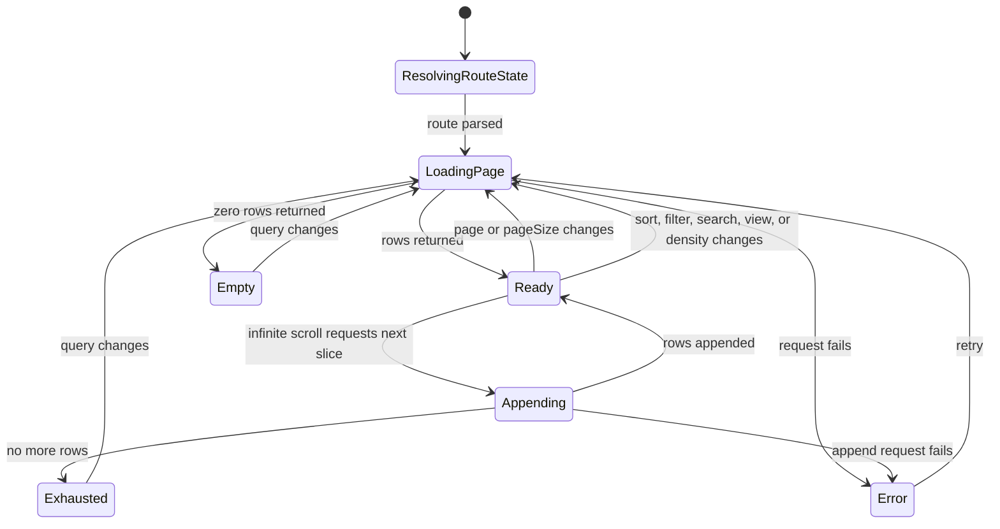
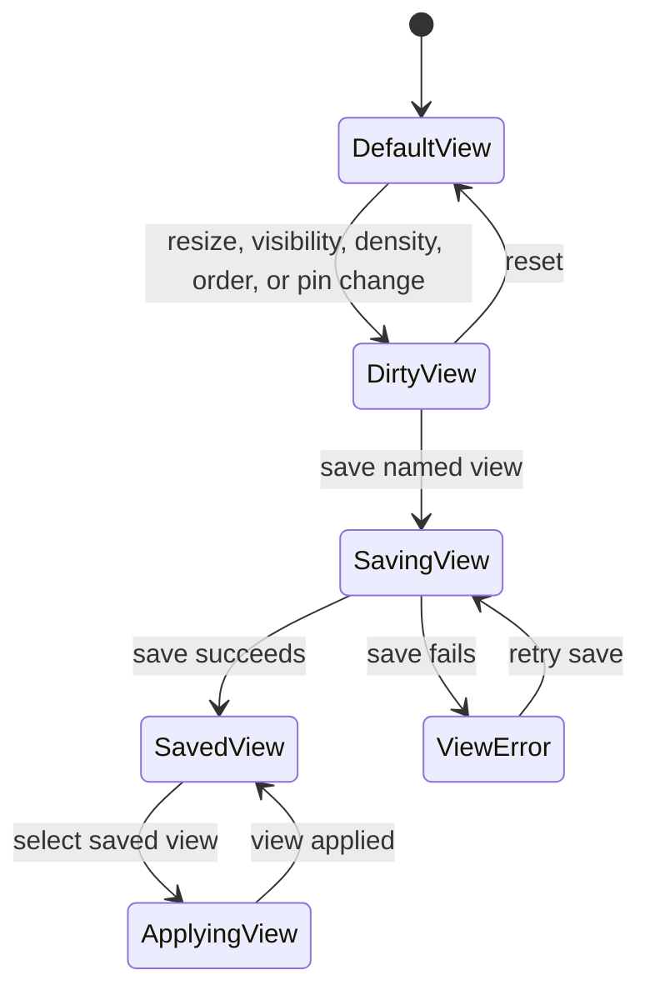
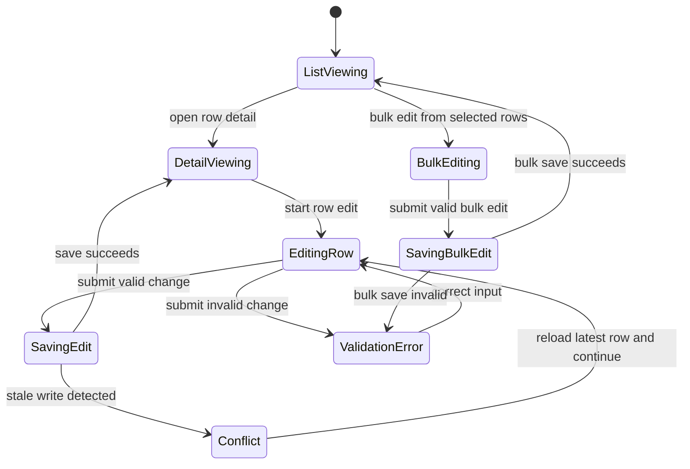
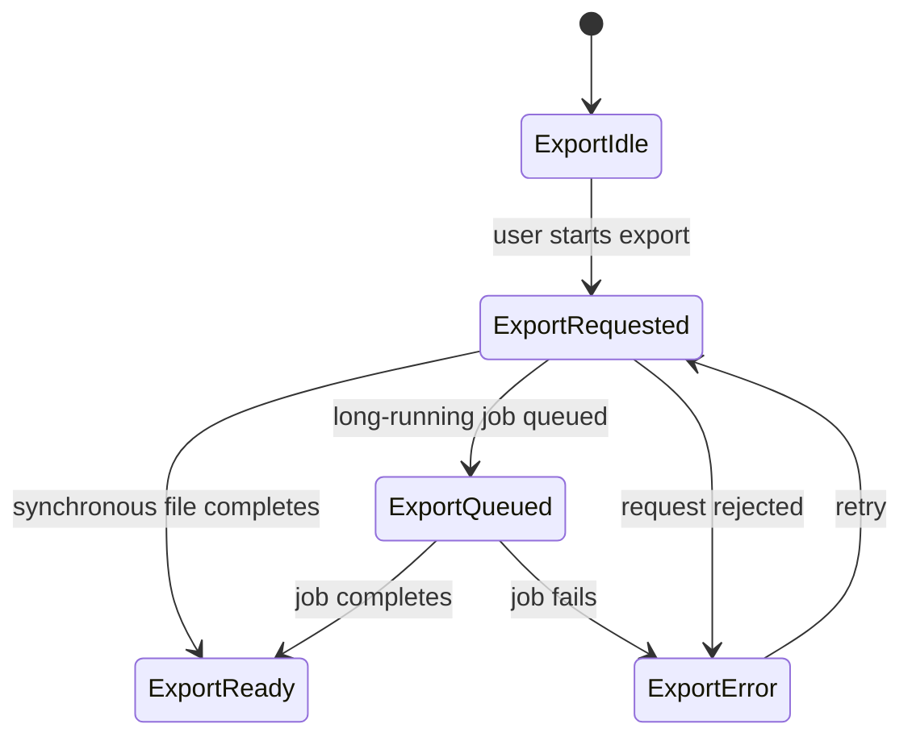

# Data Grid Specifications

Status: Proposed
Source: GitHub issue #73

## Problem statement

The repository needs a reusable data grid foundation that can support enterprise
list workflows without turning the grid into its own route or module-specific
backend. The first delivery target is R01: a compact-density enterprise operations
list that defaults to server-side pagination, sorting, and filtering for large or
growing datasets.

## Scope

### In scope

- A reusable shared data grid foundation
- Host-route integration rules for list and detail flows
- A phased delivery plan that covers every issue checklist item
- URL-driven shareable grid state through `nuqs`
- State machines and Gherkin scenarios for meaningful behavior transitions
- E2E scenario mapping for route, selector, and locale coverage

### Explicit exclusions

- A standalone `/data-grid` route
- Committing to ARIA spreadsheet-grid semantics for the baseline list experience
- Treating PDF export as a simple button-only concern; it is report generation
- Shipping every advanced enterprise feature in the first implementation slice
- Picking a final first-adopter domain model when product has not yet named one

## Constraints and assumptions

- Next.js 16 App Router, React 19, Chakra UI v3, Ark UI, `nuqs`, `next-intl`,
  Effect, Drizzle, `next-safe-action`, and Trigger.dev remain the approved stack.
- Server-first is the strong default.
- Screens and containers default to server components; client boundaries stay minimal.
- Internal mutations use server actions.
- Backend logic uses Effect services and repositories.
- Entities belong in `src/shared/entities` only.
- No cross-module imports.
- Route groups remain `(public)` and `(private)`.
- `data-testid` values must follow `<module>-<component>-<element>`.
- URL state should hold `page`, `pageSize`, `sort`, `filter`, `view`, `density`,
  and `visible-columns` when those capabilities are enabled.
- Client-side mode is acceptable only for small, bounded, already-loaded datasets.
- Virtualization is deferred until measured scale justifies it; row virtualization
  comes before column virtualization.
- Editing should start with row/detail flows before in-cell editing.
- CSV is early, XLSX is later, and large exports should become Trigger.dev jobs.
- Native table semantics come first; full ARIA grid behavior is opt-in for later
  spreadsheet-like slices.

## Convention tiering

### Hard conventions

- The reusable grid is not a route. Host resources own canonical URLs such as
  `/[locale]/(private)/<resource>` and `/[locale]/(private)/<resource>/[id]`.
- Shared grid logic belongs in shared folders; resource-specific query and domain
  logic belong in the host module.
- Data access flows through Effect services and repositories.
- Internal writes flow through server actions.
- Acceptance and E2E docs must use the repo locale set: `en` and `th`.
- Test selectors must follow the repository `data-testid` grammar.

### Strong defaults

- Prefer server-side pagination, sorting, and filtering for any large or growing
  dataset.
- Keep the grid screen server-rendered and use small client wrappers only for
  interactions that require browser state.
- Use native table semantics first.
- Keep shareable list state in the URL with `nuqs` and purely local comfort state in
  LocalStorage unless product needs server persistence.
- Prefer row/detail editing before in-cell editing.

### Local freedom

- Exact page size presets per host module
- Whether saved views are local-first, server-backed, or hybrid
- Whether a host module needs an intercepting detail overlay in addition to its
  canonical detail route
- Which columns expose masking, custom renderers, or bulk-edit affordances

## Route strategy for host modules

- The shared grid is route-agnostic.
- Each host module owns a canonical list route:
  `/[locale]/(private)/<resource>`.
- Each host module owns a canonical detail route:
  `/[locale]/(private)/<resource>/[id]`.
- Shareable grid state lives on the host list route through `nuqs`.
- Detail overlays should use intercepting and parallel routes only when the host
  module truly needs deep-linkable context-preserving detail.
- Validation examples in these docs use the reference host route
  `/[locale]/(private)/operations` because R01 is an enterprise operations list.

## Server-side architecture decisions

- Host modules define the resource-specific query schema, repository queries, and
  Effect services.
- The shared grid foundation consumes typed rows, columns, view state, and callback
  contracts; it does not query a database directly.
- The host route resolves URL state, invokes the host service, and passes paged data
  plus metadata into the shared grid.
- Data masking is enforced server-side for sensitive fields and surfaced in shared
  column definitions as a display rule, not a purely client-side obfuscation.
- Server-side pagination, multi-sort, global search, and column filters are the
  default path for R01.
- Client-side pagination remains a bounded-data fallback for already-loaded datasets.
- Row/detail edits and bulk edits post through server actions.
- Large CSV, XLSX, and PDF exports should run as Trigger.dev jobs when they exceed
  synchronous limits.

## Required state machine(s)

### State machine 1: Query and render lifecycle



### State machine 2: View customization and persistence



### State machine 3: Detail and editing lifecycle



### State machine 4: Export lifecycle



## Gherkin scenarios for meaningful transitions

### Feature: Grid query lifecycle

```gherkin
Feature: Grid query lifecycle
  As an operations user
  I want the list route to resolve grid state from the URL
  So that large datasets remain shareable and efficient

  Definitions:
    - Route state: page, pageSize, sort, filter, search, view, density, visible-columns
    - Append mode: lazy loading or infinite scroll after the first page is ready

  @must
  Scenario: Load the first page from resolved route state
    Given the host route contains a valid grid query
    When the screen resolves route state
    Then the host service loads the requested slice
    And the shared grid renders the returned rows

  @must
  Scenario: Show an empty state when no rows match
    Given the host route contains a valid grid query
    And the service returns zero rows
    When the screen renders
    Then the shared grid shows an empty state

  @must
  Scenario: Retry after a failed page load
    Given the initial request for grid data fails
    When the user retries from the error state
    Then the host service requests the page again

  @must
  Scenario: Refresh the dataset when sort, filter, search, view, or density changes
    Given the grid is showing ready data
    When the user changes page, page size, sort, filter, search, view, or density
    Then the host route updates its query state
    And the host service reloads the dataset

  @could
  Scenario: Append more rows during infinite scroll
    Given the grid is in infinite-scroll mode
    And more rows exist
    When the user scrolls to the append threshold
    Then the next slice is appended to the existing rows

  @could
  Scenario: Stop appending when the dataset is exhausted
    Given the grid is in infinite-scroll mode
    And no more rows exist
    When the user reaches the append threshold
    Then the grid marks the dataset as exhausted
```

### Feature: Grid view customization and persistence

```gherkin
Feature: Grid view customization and persistence
  As an operations user
  I want list preferences to remain reusable
  So that repeated work stays fast

  @should
  Scenario: Mark the current view as dirty after a layout change
    Given the user is viewing the default grid layout
    When the user resizes a column, changes visibility, changes density, reorders, or pins a column
    Then the current view is marked as dirty

  @should
  Scenario: Save a named view
    Given the current view is dirty
    When the user saves a named view
    Then the view is persisted
    And it becomes selectable later

  @should
  Scenario: Reapply a saved view
    Given at least one saved view exists
    When the user selects a saved view
    Then the grid applies the saved column and filter state

  @should
  Scenario: Reset to the default view
    Given the current view is dirty
    When the user resets the view
    Then the default layout is restored

  @should
  Scenario: Retry after a failed view save
    Given saving a named view fails
    When the user retries the save
    Then the view save is attempted again
```

### Feature: Detail and editing lifecycle

```gherkin
Feature: Detail and editing lifecycle
  As an operations user
  I want row detail and editing flows to stay canonical
  So that data changes remain auditable and shareable

  @should
  Scenario: Open canonical row detail from the list
    Given the user is viewing the list route
    When the user opens a row
    Then the host detail route is resolved for that row

  @should
  Scenario: Save a valid row-based edit
    Given the user is editing a row in the canonical detail flow
    When the user submits valid changes
    Then the server action saves the row
    And the latest detail view is shown

  @should
  Scenario: Show validation errors during row editing
    Given the user is editing a row
    When the user submits invalid changes
    Then validation errors are shown
    And the edit form remains open

  @should
  Scenario: Recover from a stale write conflict
    Given another change updated the same row
    When the user submits an outdated edit
    Then the user sees a conflict state
    And can reload the latest row before continuing

  @should
  Scenario: Save a valid bulk edit from selected rows
    Given the user selected multiple rows
    When the user submits a valid bulk edit
    Then the server action updates the selected rows
```

### Feature: Export lifecycle

```gherkin
Feature: Export lifecycle
  As an operations user
  I want exports that match dataset size
  So that small exports stay fast and large exports remain reliable

  @should
  Scenario: Complete a synchronous CSV export
    Given the current dataset is within the synchronous export limit
    When the user starts a CSV export
    Then the export file is delivered without background job polling

  @should
  Scenario: Queue a large export job
    Given the current dataset exceeds the synchronous export limit
    When the user starts an XLSX or PDF export
    Then a Trigger.dev job is queued
    And the user sees queued export status

  @should
  Scenario: Retry a failed export
    Given a queued or synchronous export fails
    When the user retries the export
    Then the export request is submitted again
```

## Acceptance criteria

- The documentation defines the data grid as a reusable foundation plus host-route
  integration rules, not as a standalone route.
- The documentation names R01 as the first delivery slice: an enterprise operations
  list with compact density.
- The documentation defaults large or growing datasets to server-side pagination,
  sorting, and filtering.
- The documentation explicitly limits client-side mode to small, bounded,
  already-loaded datasets.
- The documentation records shareable URL state through `nuqs` on host routes.
- The documentation requires canonical host list and detail routes.
- The documentation limits intercepting detail overlays to host modules that truly
  need them.
- The documentation phases virtualization and places row virtualization before column
  virtualization.
- The documentation favors row/detail editing before in-cell editing.
- The documentation places CSV earlier than XLSX and treats PDF as report generation.
- The documentation assigns large exports to Trigger.dev jobs.
- The documentation uses native table semantics as the baseline.
- The documentation includes required state machines with Gherkin scenarios for each
  meaningful transition.
- The documentation maps `@must` scenarios to both `en` and `th` in E2E planning.
- The overview maps every issue checklist item to a delivery phase.

## Open questions

- Which host resource should adopt the grid first after the reference
  `operations` example?
- What are the default page size presets and the maximum allowed page size for R01?
- Which columns require masking, and which roles may reveal unmasked values?
- Should saved views persist only in LocalStorage at first, or also on the server
  per user?
- What dataset threshold should switch exports from synchronous delivery to
  Trigger.dev jobs?
- Does the first adopter actually need deep-linkable detail overlays, or are
  canonical detail routes sufficient?
- Is spreadsheet-like range selection a real near-term requirement, or can it stay
  in the final phase?
